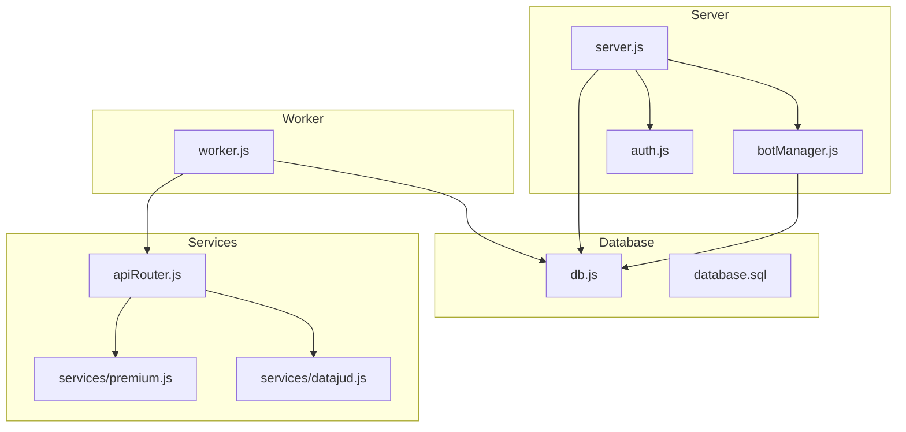
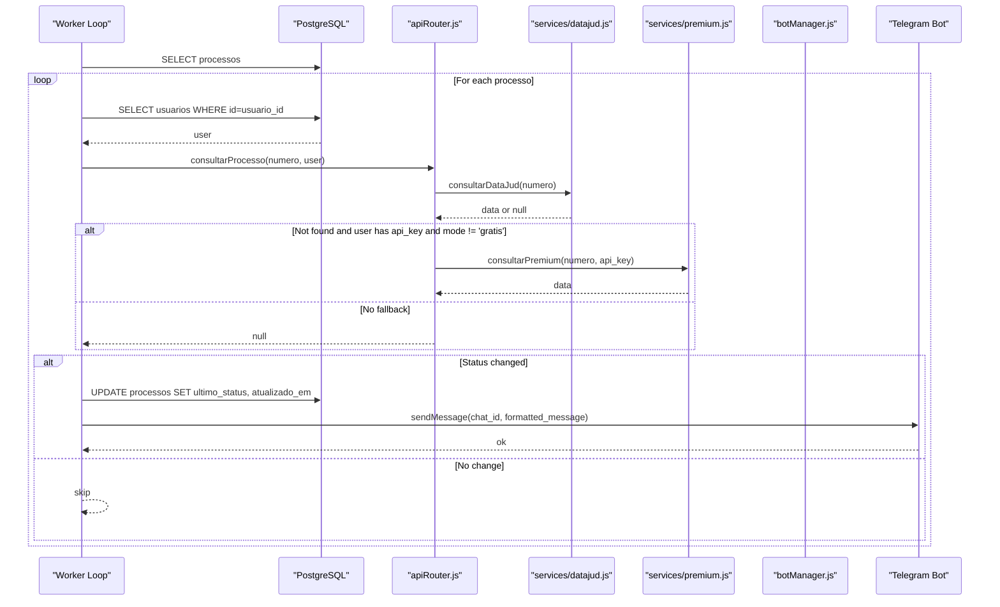
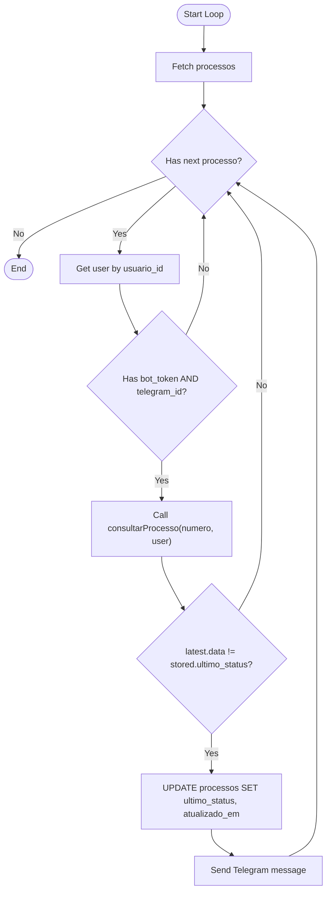
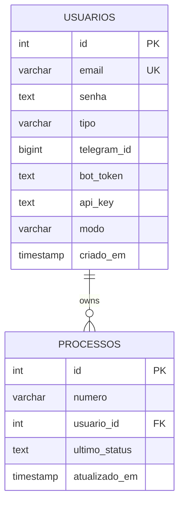
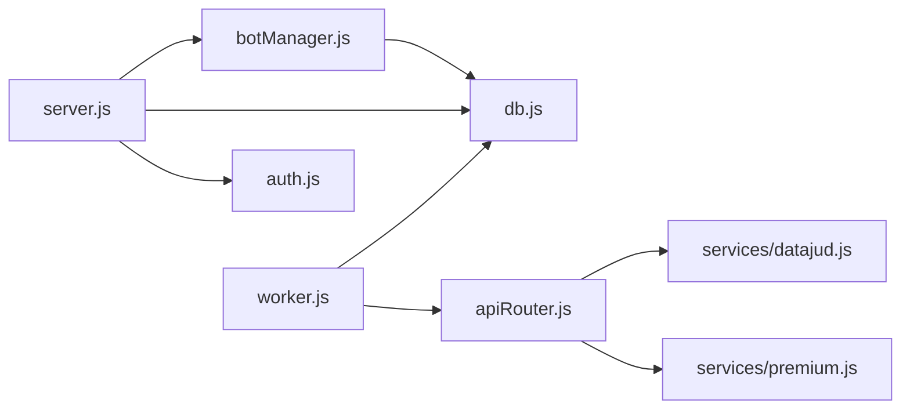

# Worker Coordination System

<cite>
**Referenced Files in This Document**
- [worker.js](file://worker.js)
- [botManager.js](file://botManager.js)
- [server.js](file://server.js)
- [apiRouter.js](file://apiRouter.js)
- [datajud.js](file://services/datajud.js)
- [premium.js](file://services/premium.js)
- [db.js](file://db.js)
- [database.sql](file://database.sql)
- [auth.js](file://auth.js)
- [package.json](file://package.json)
- [README.md](file://README.md)
</cite>

## Table of Contents
1. [Introduction](#introduction)
2. [Project Structure](#project-structure)
3. [Core Components](#core-components)
4. [Architecture Overview](#architecture-overview)
5. [Detailed Component Analysis](#detailed-component-analysis)
6. [Dependency Analysis](#dependency-analysis)
7. [Performance Considerations](#performance-considerations)
8. [Troubleshooting Guide](#troubleshooting-guide)
9. [Conclusion](#conclusion)
10. [Appendices](#appendices)

## Introduction
This document explains the background worker system responsible for monitoring legal process status changes and delivering real-time notifications to users via Telegram bots. It covers how the worker coordinates with the bot management layer, performs scheduled status checks, detects status changes, and sends notifications. It also documents initialization, configuration, scheduling, notification formatting, and troubleshooting strategies for timeouts and notification failures.

## Project Structure
The system consists of:
- A web server that manages Telegram bots and exposes administrative APIs
- A background worker that periodically checks process statuses and sends notifications
- A PostgreSQL database storing users and monitored processes
- Services for free and paid process data retrieval
- Authentication middleware and environment configuration

**Diagram sources**
- [server.js:1-162](file://server.js#L1-L162)
- [botManager.js:1-53](file://botManager.js#L1-L53)
- [worker.js:1-70](file://worker.js#L1-L70)
- [apiRouter.js:1-19](file://apiRouter.js#L1-L19)
- [datajud.js:1-32](file://services/datajud.js#L1-L32)
- [premium.js:1-12](file://services/premium.js#L1-L12)
- [db.js:1-11](file://db.js#L1-L11)
- [database.sql:1-25](file://database.sql#L1-L25)

**Section sources**
- [README.md:1-56](file://README.md#L1-L56)
- [package.json:1-21](file://package.json#L1-L21)

## Core Components
- Background worker: Periodically queries monitored processes, compares last known status with latest data, updates records, and sends Telegram notifications.
- Bot management: Initializes and maintains Telegram bot instances per user, handles user commands, and inserts monitored processes.
- API router: Chooses between free and paid data sources for process information.
- Data services: Free (DataJud) and paid (Premium) integrations.
- Database: Stores users and monitored processes with foreign key relationships.
- Authentication: JWT-based middleware for protected routes.

**Section sources**
- [worker.js:1-70](file://worker.js#L1-L70)
- [botManager.js:1-53](file://botManager.js#L1-L53)
- [apiRouter.js:1-19](file://apiRouter.js#L1-L19)
- [datajud.js:1-32](file://services/datajud.js#L1-L32)
- [premium.js:1-12](file://services/premium.js#L1-L12)
- [db.js:1-11](file://db.js#L1-L11)
- [database.sql:18-24](file://database.sql#L18-L24)
- [auth.js:16-39](file://auth.js#L16-L39)

## Architecture Overview
The worker runs independently from the server and periodically polls the database for monitored processes. For each process, it retrieves the associated user, validates Telegram credentials, fetches the latest status via the API router, compares it with the stored last status, and sends a Telegram message if changed. The server initializes user-specific bots and handles user interactions.

**Diagram sources**
- [worker.js:17-61](file://worker.js#L17-L61)
- [apiRouter.js:4-16](file://apiRouter.js#L4-L16)
- [datajud.js:3-29](file://services/datajud.js#L3-L29)
- [premium.js:1-12](file://services/premium.js#L1-L12)

## Detailed Component Analysis

### Worker Initialization and Scheduling
- The worker sets up a recurring interval to execute the monitoring loop every five minutes.
- On startup, it immediately runs the loop to avoid delay.
- It logs timestamps to indicate when checks occur.

Key behaviors:
- Uses a cache of Telegram bot instances keyed by token to avoid recreating clients.
- Queries all monitored processes and groups by user to minimize repeated user lookups.
- Validates that each user has both Telegram chat ID and bot token before attempting notifications.

**Section sources**
- [worker.js:63-70](file://worker.js#L63-L70)
- [worker.js:9-15](file://worker.js#L9-L15)
- [worker.js:20-34](file://worker.js#L20-L34)

### Process Monitoring Logic
- Retrieves all monitored processes from the database.
- For each process, fetches the associated user record and verifies Telegram credentials.
- Calls the API router to obtain the latest process data:
  - First tries the free DataJud service.
  - Falls back to the paid Premium service if configured and allowed.
- Compares the latest data’s date/time with the stored last status.
- Updates the database with the new status and timestamp if changed.
- Sends a formatted Telegram message to the user’s chat.

Notification formatting:
- Uses a simple template indicating an update, the process number, and the new date/time.

**Section sources**
- [worker.js:25-60](file://worker.js#L25-L60)
- [apiRouter.js:4-16](file://apiRouter.js#L4-L16)
- [datajud.js:3-29](file://services/datajud.js#L3-L29)
- [premium.js:1-12](file://services/premium.js#L1-L12)

### Status Change Detection Algorithm
- Compares the latest status date/time from the API response with the stored last status in the database.
- If different, updates the stored last status and triggers a notification.
- Timestamps the update to reflect the last successful check.

**Diagram sources**
- [worker.js:17-61](file://worker.js#L17-L61)

### Bot Management Integration
- The worker does not manage bot instances; it relies on cached instances created by the server-side bot manager.
- The server loads existing users’ bots on startup and registers message handlers to add new monitored processes when users send process numbers.
- The worker uses the Telegram bot client per user to deliver notifications.

Operational notes:
- The server’s bot manager caches bot instances keyed by token to avoid recreation.
- The server initializes bots for users who registered with tokens during creation or manual addition.

**Section sources**
- [worker.js:42-43](file://worker.js#L42-L43)
- [botManager.js:7-42](file://botManager.js#L7-L42)
- [server.js:137-140](file://server.js#L137-L140)

### Notification Delivery Workflow
- The worker constructs a simple message containing the process number and the new status date/time.
- It sends the message to the user’s Telegram chat ID using the cached Telegram bot instance.
- The message is sent only when a status change is detected.

**Section sources**
- [worker.js:56-58](file://worker.js#L56-L58)

### Database Schema and Relationships
- Users table stores Telegram identifiers, bot tokens, API keys, and mode flags.
- Processes table references users and tracks the last known status and update timestamp.
- Foreign key ensures referential integrity between users and their monitored processes.

**Diagram sources**
- [database.sql:5-24](file://database.sql#L5-L24)

**Section sources**
- [database.sql:5-24](file://database.sql#L5-L24)

### API Router and Data Services
- The API router attempts free data retrieval first, then falls back to paid retrieval if configured.
- Free service uses DataJud CNJ API.
- Paid service is a placeholder for premium providers.

**Section sources**
- [apiRouter.js:4-16](file://apiRouter.js#L4-L16)
- [datajud.js:3-29](file://services/datajud.js#L3-L29)
- [premium.js:1-12](file://services/premium.js#L1-L12)

## Dependency Analysis
- The worker depends on:
  - Database connection for process and user queries
  - API router for retrieving process data
  - Telegram bot client for notifications
- The server depends on:
  - Database for user and process storage
  - Bot manager for initializing and maintaining user bots
  - Authentication middleware for protected routes
- Data services depend on external APIs and are encapsulated behind the API router.

**Diagram sources**
- [worker.js:1-70](file://worker.js#L1-L70)
- [apiRouter.js:1-19](file://apiRouter.js#L1-L19)
- [datajud.js:1-32](file://services/datajud.js#L1-L32)
- [premium.js:1-12](file://services/premium.js#L1-L12)
- [server.js:1-162](file://server.js#L1-L162)
- [botManager.js:1-53](file://botManager.js#L1-L53)
- [auth.js:1-59](file://auth.js#L1-L59)
- [db.js:1-11](file://db.js#L1-L11)

**Section sources**
- [worker.js:1-70](file://worker.js#L1-L70)
- [server.js:1-162](file://server.js#L1-L162)
- [botManager.js:1-53](file://botManager.js#L1-L53)
- [apiRouter.js:1-19](file://apiRouter.js#L1-L19)
- [datajud.js:1-32](file://services/datajud.js#L1-L32)
- [premium.js:1-12](file://services/premium.js#L1-L12)
- [db.js:1-11](file://db.js#L1-L11)
- [auth.js:1-59](file://auth.js#L1-L59)

## Performance Considerations
- The worker queries all monitored processes on each cycle. Consider partitioning or indexing strategies if the dataset grows large.
- Grouping by user reduces redundant user lookups, but still iterates through all processes.
- The Telegram bot cache avoids repeated client instantiation, reducing overhead.
- The polling interval is fixed at five minutes. Adjust based on acceptable latency and API rate limits.
- External API calls (free and paid) introduce network latency; consider adding timeouts and retries.

[No sources needed since this section provides general guidance]

## Troubleshooting Guide
Common issues and resolutions:

- Worker not sending notifications
  - Verify the user has both bot_token and telegram_id set in the database.
  - Confirm the Telegram bot is initialized and cached by the server.
  - Check that the worker’s Telegram bot cache returns a valid client.

- No status updates detected
  - Ensure the API router returns data for the given process number.
  - Confirm the latest status date differs from stored last status.
  - Verify the database update query executes successfully.

- Timeout or network errors
  - External API calls may fail; implement retry logic and timeouts in the API router or services.
  - Add error logging around Telegram sendMessage to capture failures.

- Duplicate or missing messages
  - The worker only sends when the status changes; ensure the comparison logic is correct.
  - Validate that the Telegram chat ID is correct and the bot has permission to message the user.

- Worker not starting
  - Ensure the worker script is executed separately from the server.
  - Confirm environment variables for database and Telegram are configured.

**Section sources**
- [worker.js:39-43](file://worker.js#L39-L43)
- [worker.js:49-58](file://worker.js#L49-L58)
- [apiRouter.js:4-16](file://apiRouter.js#L4-L16)
- [server.js:137-140](file://server.js#L137-L140)

## Conclusion
The worker system provides a lightweight, event-driven mechanism to monitor legal process statuses and notify users via Telegram. Its design separates concerns between the server (user interactions and bot lifecycle) and the worker (periodic checks and notifications). By leveraging caching, grouped queries, and a simple status-change detection algorithm, it efficiently scales to multiple users while remaining easy to operate and troubleshoot.

[No sources needed since this section summarizes without analyzing specific files]

## Appendices

### Practical Configuration Examples
- Running the worker
  - Start the server and bots: npm start
  - Start the worker in a separate terminal: npm run worker

- Environment variables
  - Database: DB_HOST, DB_USER, DB_PASSWORD, DB_NAME, DB_PORT
  - JWT secret: JWT_SECRET
  - Telegram bot token: Provided by users during registration

- Monitoring intervals
  - The worker runs every five minutes by default. Adjust the interval in the worker file if needed.

- Notification formatting
  - The worker sends a simple message with the process number and the new status date/time. Customize the message template in the worker if desired.

**Section sources**
- [README.md:28-41](file://README.md#L28-L41)
- [worker.js:63-70](file://worker.js#L63-L70)
- [worker.js:56-58](file://worker.js#L56-L58)
- [package.json:5-10](file://package.json#L5-L10)