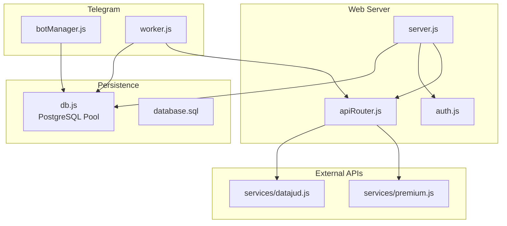
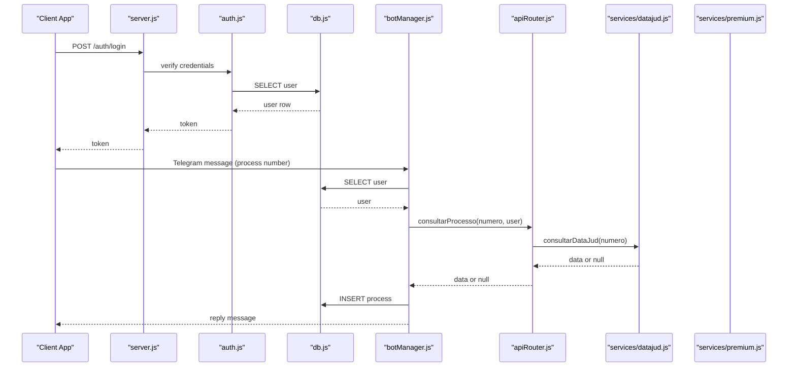
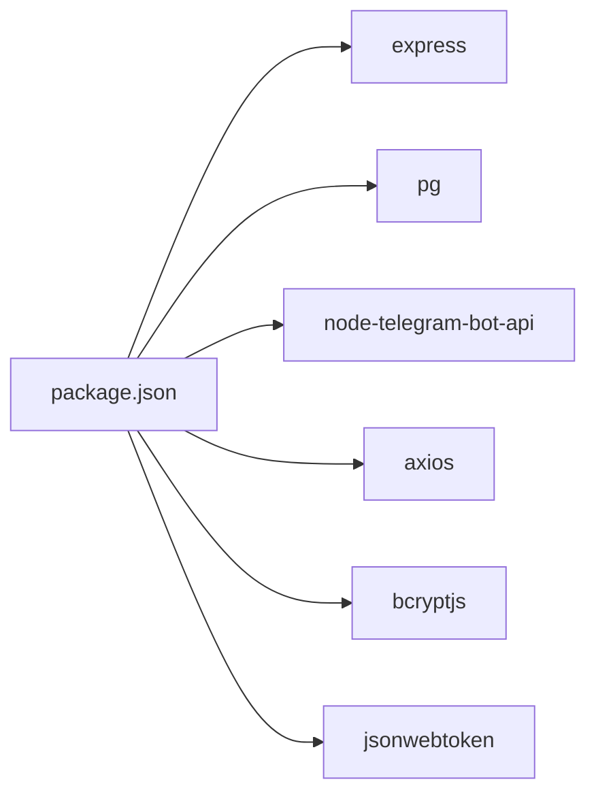

# Troubleshooting and FAQ

<cite>
**Referenced Files in This Document**
- [server.js](file://server.js)
- [db.js](file://db.js)
- [botManager.js](file://botManager.js)
- [worker.js](file://worker.js)
- [auth.js](file://auth.js)
- [apiRouter.js](file://apiRouter.js)
- [datajud.js](file://services/datajud.js)
- [premium.js](file://services/premium.js)
- [database.sql](file://database.sql)
- [package.json](file://package.json)
- [README.md](file://README.md)
</cite>

## Table of Contents
1. [Introduction](#introduction)
2. [Project Structure](#project-structure)
3. [Core Components](#core-components)
4. [Architecture Overview](#architecture-overview)
5. [Detailed Component Analysis](#detailed-component-analysis)
6. [Dependency Analysis](#dependency-analysis)
7. [Performance Considerations](#performance-considerations)
8. [Troubleshooting Guide](#troubleshooting-guide)
9. [Conclusion](#conclusion)
10. [Appendices](#appendices)

## Introduction
This document provides a comprehensive troubleshooting guide for the Judicial Process Monitoring SaaS. It focuses on diagnosing and resolving common issues related to database connectivity, Telegram bot communication, API service availability, and authentication. It also covers performance optimization, error handling, monitoring, and escalation procedures.

## Project Structure
The system consists of:
- Express server exposing REST endpoints for registration, login, administration, and process retrieval
- PostgreSQL persistence via a connection pool
- Telegram bot integration for inbound/outbound messaging
- Background worker that periodically checks for process updates and notifies users
- Authentication middleware using JWT and bcrypt
- External API integrations (free and paid tiers)

**Diagram sources**
- [server.js:1-162](file://server.js#L1-L162)
- [db.js:1-11](file://db.js#L1-L11)
- [botManager.js:1-53](file://botManager.js#L1-L53)
- [worker.js:1-70](file://worker.js#L1-L70)
- [auth.js:1-59](file://auth.js#L1-L59)
- [apiRouter.js:1-19](file://apiRouter.js#L1-L19)
- [datajud.js:1-32](file://services/datajud.js#L1-L32)
- [premium.js:1-12](file://services/premium.js#L1-L12)
- [database.sql:1-25](file://database.sql#L1-L25)

**Section sources**
- [README.md:1-56](file://README.md#L1-L56)
- [package.json:1-21](file://package.json#L1-L21)

## Core Components
- Database connectivity: configured via environment variables and exposed as a connection pool
- Authentication: JWT-based protected routes and admin-only endpoints
- Telegram bot: inbound message handler and outbound notifications
- Worker: periodic updater of monitored processes and Telegram alerts
- API router: free tier fallback to paid tier for richer data

**Section sources**
- [db.js:1-11](file://db.js#L1-L11)
- [auth.js:1-59](file://auth.js#L1-L59)
- [botManager.js:1-53](file://botManager.js#L1-L53)
- [worker.js:1-70](file://worker.js#L1-L70)
- [apiRouter.js:1-19](file://apiRouter.js#L1-L19)

## Architecture Overview
High-level flow:
- Clients register/login and receive JWT tokens
- Users configure Telegram ID and Bot Token
- Users send process numbers to the Telegram bot
- The bot queries external APIs and persists results
- The worker periodically checks for updates and sends Telegram notifications

**Diagram sources**
- [server.js:39-68](file://server.js#L39-L68)
- [auth.js:17-31](file://auth.js#L17-L31)
- [db.js:1-11](file://db.js#L1-L11)
- [botManager.js:13-39](file://botManager.js#L13-L39)
- [apiRouter.js:4-16](file://apiRouter.js#L4-L16)
- [datajud.js:3-29](file://services/datajud.js#L3-L29)
- [premium.js:1-12](file://services/premium.js#L1-L12)

## Detailed Component Analysis

### Database Connectivity
Common symptoms:
- Application startup fails with connection errors
- Queries timeout or fail intermittently
- Pool exhaustion under load

Root causes and diagnostics:
- Verify environment variables for host, user, password, database, port
- Confirm PostgreSQL is reachable from the host machine
- Check pool limits and connection timeouts
- Inspect logs for “connect ECONNREFUSED” or “authentication failed”

Recovery steps:
- Correct .env values and restart services
- Ensure firewall allows inbound connections on DB port
- Scale up pool max connections if needed
- Validate database credentials and roles

Performance tips:
- Tune pool min/max connections and idle timeout
- Use connection pooling per process
- Prefer prepared statements and parameterized queries

**Section sources**
- [db.js:1-11](file://db.js#L1-L11)
- [database.sql:5-24](file://database.sql#L5-L24)
- [server.js:137-140](file://server.js#L137-L140)

### Telegram Bot Communication
Common symptoms:
- No response to messages
- Messages not sent to users
- Duplicate or missing notifications

Root causes and diagnostics:
- Confirm bot_token and telegram_id are set for the user
- Validate bot token validity and permissions
- Check network connectivity to Telegram API
- Review worker logs for exceptions during sendMessage

Recovery steps:
- Reconfigure bot token and Telegram ID in admin panel
- Restart the worker to refresh bot instances
- Ensure the bot is started on server boot

Performance tips:
- Cache bot instances keyed by token to avoid recreation
- Batch or throttle notifications to Telegram rate limits

**Section sources**
- [botManager.js:7-42](file://botManager.js#L7-L42)
- [worker.js:9-15](file://worker.js#L9-L15)
- [worker.js:42-58](file://worker.js#L42-L58)

### API Service Unavailability
Common symptoms:
- Empty results for process numbers
- Frequent timeouts or errors from external APIs
- Mixed free/paid tier behavior

Root causes and diagnostics:
- Free tier endpoint may return empty hits
- Paid tier requires a valid API key and correct mode
- Network latency or upstream downtime

Recovery steps:
- Switch user to paid mode and provide a valid API key
- Retry after upstream service stability improves
- Validate API key format and permissions

Performance tips:
- Implement exponential backoff for retries
- Cache recent successful lookups
- Log upstream response codes and latency

**Section sources**
- [apiRouter.js:4-16](file://apiRouter.js#L4-L16)
- [datajud.js:3-29](file://services/datajud.js#L3-L29)
- [premium.js:1-12](file://services/premium.js#L1-L12)

### Authentication Issues
Common symptoms:
- 401 Token not provided or invalid
- 403 Access restricted to administrators
- Login failures despite correct credentials

Root causes and diagnostics:
- Missing Authorization header or malformed Bearer token
- Expired or tampered JWT
- Non-admin attempting admin-only endpoints

Recovery steps:
- Ensure clients send Authorization: Bearer <token>
- Regenerate token after secret changes
- Verify user role and permissions

**Section sources**
- [auth.js:17-31](file://auth.js#L17-L31)
- [auth.js:34-39](file://auth.js#L34-L39)
- [server.js:12-36](file://server.js#L12-L36)
- [server.js:71-92](file://server.js#L71-L92)

## Dependency Analysis
Runtime dependencies and their roles:
- express: HTTP server and routing
- pg: PostgreSQL client and connection pooling
- node-telegram-bot-api: Telegram bot SDK
- axios: HTTP client for external APIs
- bcryptjs/jsonwebtoken: Password hashing and JWT signing

**Diagram sources**
- [package.json:11-19](file://package.json#L11-L19)

**Section sources**
- [package.json:1-21](file://package.json#L1-L21)

## Performance Considerations
Database:
- Use connection pooling and limit concurrent queries
- Index frequently queried columns (e.g., usuarios.email, processos.numero)
- Batch updates and minimize roundtrips

Telegram:
- Cache bot instances by token
- Coalesce frequent updates to reduce message volume
- Respect rate limits and implement retry with backoff

API:
- Prefer caching and deduplicate requests
- Implement circuit breaker for upstream failures
- Monitor response latency and error rates

Worker:
- Run at fixed intervals (currently every 5 minutes)
- Use grouped queries per user to reduce DB calls
- Avoid blocking operations in message handlers

**Section sources**
- [worker.js:20-60](file://worker.js#L20-L60)
- [botManager.js:13-39](file://botManager.js#L13-L39)
- [datajud.js:3-29](file://services/datajud.js#L3-L29)

## Troubleshooting Guide

### Step-by-Step Resolution Guides

#### Issue: Database Connection Failure
Symptoms:
- Startup error indicating inability to connect
- Queries failing with connection-related errors

Diagnostics:
- Check environment variables for DB_HOST, DB_USER, DB_PASSWORD, DB_NAME, DB_PORT
- Verify PostgreSQL is running and accepting connections
- Review logs for connection refused or authentication errors

Resolution:
- Fix .env values and restart server and worker
- Confirm firewall and network ACLs
- Increase pool limits if under heavy load

**Section sources**
- [db.js:4-10](file://db.js#L4-L10)
- [server.js:137-140](file://server.js#L137-L140)

#### Issue: Telegram Bot Not Responding
Symptoms:
- No replies to process number messages
- Notifications not sent to users

Diagnostics:
- Confirm telegram_id and bot_token are set for the user
- Check worker logs for sendMessage failures
- Validate bot token validity

Resolution:
- Re-enter Telegram ID and Bot Token in admin panel
- Restart worker to reload bot instances
- Ensure bot is started on server initialization

**Section sources**
- [botManager.js:7-42](file://botManager.js#L7-L42)
- [worker.js:42-58](file://worker.js#L42-L58)
- [server.js:137-139](file://server.js#L137-L139)

#### Issue: API Service Unavailable or Returns No Data
Symptoms:
- Process lookup returns empty
- Frequent timeouts or upstream errors

Diagnostics:
- Check free tier response for empty hits
- Verify paid tier API key and mode setting
- Monitor external API health

Resolution:
- Enable paid mode and provide a valid API key
- Retry after upstream stability improves
- Implement retry with backoff in client logic

**Section sources**
- [apiRouter.js:4-16](file://apiRouter.js#L4-L16)
- [datajud.js:3-29](file://services/datajud.js#L3-L29)

#### Issue: Authentication Failures
Symptoms:
- 401 Token not provided or invalid
- 403 Access denied for admin endpoints

Diagnostics:
- Verify Authorization header format
- Confirm JWT secret consistency
- Check user role and permissions

Resolution:
- Ensure clients send Authorization: Bearer <token>
- Rotate JWT secret carefully and update all clients
- Verify admin role assignment

**Section sources**
- [auth.js:17-31](file://auth.js#L17-L31)
- [auth.js:34-39](file://auth.js#L34-L39)
- [server.js:39-68](file://server.js#L39-L68)

### Error Codes and Exception Handling
- HTTP 400: Registration with duplicate email (unique constraint violation)
- HTTP 401: Missing or invalid token; incorrect credentials
- HTTP 403: Non-admin attempting admin-only endpoint
- HTTP 500: Internal server errors for unexpected failures
- External API: Graceful fallback from free to paid tier

Operational notes:
- Unique constraint violations are caught and mapped to user-friendly messages
- Authentication middleware centralizes token verification
- API router implements tiered fallback logic

**Section sources**
- [server.js:31-34](file://server.js#L31-L34)
- [auth.js:20-30](file://auth.js#L20-L30)
- [server.js:71-92](file://server.js#L71-L92)
- [apiRouter.js:4-16](file://apiRouter.js#L4-L16)

### Logging and Debugging Workflows
Recommended logging targets:
- Database pool connection events and query durations
- Telegram API sendMessage outcomes and errors
- External API request/response metrics and error codes
- Authentication attempts and token validations
- Worker loop execution timestamps and processed counts

Debugging steps:
- Enable verbose logging for 5–10 minutes during incident
- Correlate timestamps across server, worker, and Telegram logs
- Capture request IDs and trace them through the pipeline
- Validate environment variables and secrets rotation

[No sources needed since this section provides general guidance]

### Monitoring and Alerting
Proactive detection ideas:
- Health checks for database connectivity and query latency
- Uptime monitoring for Telegram API and external endpoints
- Error rate thresholds for authentication and API routes
- Worker loop execution gaps and missed cycles
- Rate limiting and quota alerts for Telegram and external APIs

Alerting channels:
- Email/SMS for critical outages
- Slack/Discord for operational updates
- Pager duty for 24/7 coverage

[No sources needed since this section provides general guidance]

### Escalation Procedures and Support Resources
Escalation ladder:
- Tier 1: Self-service (check logs, verify environment, retry)
- Tier 2: Community support (GitHub Discussions/Issues)
- Tier 3: Vendor support (external API providers)

Support channels:
- GitHub Issues for bug reports and feature requests
- Community forum for peer-to-peer help
- Contact administrator for account and permission issues

[No sources needed since this section provides general guidance]

## Conclusion
This guide consolidates practical troubleshooting, performance tuning, and operational best practices for the Judicial Process Monitoring SaaS. By following the diagnostic workflows, applying the recommended optimizations, and establishing robust monitoring, teams can maintain reliable service delivery and quickly resolve incidents.

## Appendices

### Environment Variables Reference
- DB_HOST, DB_USER, DB_PASSWORD, DB_NAME, DB_PORT: PostgreSQL connection
- JWT_SECRET: Secret for signing JWT tokens
- PORT: Web server port

**Section sources**
- [db.js:4-10](file://db.js#L4-L10)
- [auth.js:5](file://auth.js#L5)
- [server.js:137-139](file://server.js#L137-L139)

### Database Schema Overview
Tables:
- usuarios: user profiles, Telegram IDs, bot tokens, API keys, modes
- processos: monitored process records linked to users

Indexes and constraints:
- Unique email on usuarios
- Foreign key from processos.usuario_id to usuarios.id

**Section sources**
- [database.sql:5-24](file://database.sql#L5-L24)